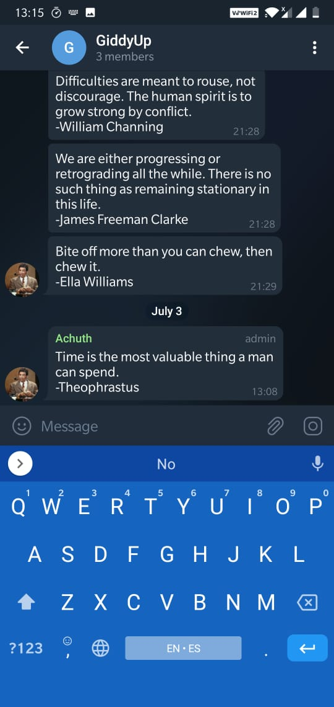

### Features
- Pings you the motivational quotes in Telegram.
- This code can be used to run in your servers to ping the motivational quotes as per the frequency of your choice by setting cronjobs.

## Telegram Bot 
### Create Telegram Bot
Unlike Whatsapp Bot, Telegram Bots are free to use. Telegram Bot are widely used by several developers to build applications. First you need to have a Telegram Account and bot can be registered by following the [link](https://sendpulse.com/knowledge-base/chatbot/create-telegram-chatbot)

### Copy the Telegram Token
Copy the Telegram Access Token in to a credentials file. The telegram access token looks like this
```
[telegram]
accessToken = 1891112227:AAHdsasd&askjlasMIya6ppKGu9lAKluiMtkwdSsiZdx_f0
```

### Export the Location of creds File into environment variable
To avoid access tokens being shared, I follow this apporach of having the path to credentials file stored in a environment variable
```
export DevKeys=/Users/Achuth/Keys/cred
```

### Get the Chat Id of the Space
Get the chat Id of the space you want to ping the notifications to and copy the chat id to the chatIds dictionary.
```
ChatIds= {
    "GiddyUp":"-1001428866192"
}
```

## Installations and Dependencies
```
$ pip3 install -r requirements.txt
```

## How to run the Script ?
```
$ python3 indiaNewsNotifier.py
```

## Output
